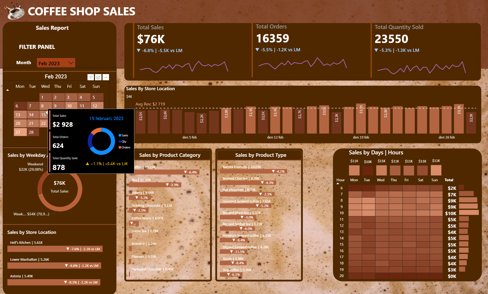

# Coffee Shop Sales Dashboard (MySQL + Power BI)

## Overview
This project analyzes sales data from a coffee shop dataset using **MySQL** for data preparation and **Power BI** for building an interactive dashboard.

The goal was to transform a raw Kaggle dataset into a polished reporting tool that provides insights into **sales performance, store activity, product categories, and customer behavior**.

---

## Objectives
- Track the core KPIs: **sales revenue ($), orders, and quantity sold**.
- Compare performance month-to-month with both **% change and absolute difference**.
- Visualize sales trends over time.
- Explore sales by:
  - Product category & product type.
  - Weekday vs weekend.
  - Store location.
  - Day & hour activity.
- Implement a **calendar heatmap** for daily performance monitoring.

---

## Project Workflow

### 1. Data Preparation (MySQL)
1. Downloaded dataset from [Kaggle](https://www.kaggle.com/datasets/ahmedabbas757/coffee-sales/data).
2. Converted `.xlsx` → `.csv` and imported into MySQL database.
3. Cleaned column names and standardized date/time formats.
4. Wrote SQL queries to:
   - Calculate revenue (`unit_price × quantity`).
   - Aggregate monthly totals (sales, orders, quantities).
   - Calculate month-to-month % and absolute changes.
5. Exported results for Power BI visualization.

### 2. Visualization (Power BI)
Two main options were considered for integrating data into Power BI:
1. Import prepared tables directly from MySQL.
2. Transform the data using SQL queries inside Power BI.

For this project, I chose the **first option**: importing the prepared tables from MySQL into Power BI.
This gave me flexibility in the dashboard design and the ability to use **DAX** for additional calculations.

---

## Dashboard Features

### Header Section
- Title image (coffee mug) + background with subtle coffee bubble theme.
- KPI cards for:
  - **Total Sales ($k)**.
  - **Total Orders**.
  - **Total Quantity Sold**.
- Each card includes: current value, % difference vs last month, absolute difference, and a mini trend line.

---

### Sales Report Panel
- Filter panel to select **months (Jan–Jun 2023)**.
- **Calendar Heatmap** with daily sales values.
- Hover tooltip showing detailed metrics per day, including:
  - Drill-down donut chart of total sales, orders, and quantity sold.
  - % and absolute difference vs last month.

---

### 📈 Deeper Insights
- **Weekend vs Weekday Sales**: donut chart split.
- **Sales by Store Location**:
  - Orders (k).
  - % and $k difference vs last month.
- **Daily Sales Trend by Store**:
  - Line chart with average revenue line ($2,719/day).
  - Fully interactive (e.g. filter to only weekends).

---

### Product-Level Analysis
- **Sales by Product Category**: bar chart with quantities and % difference vs last month.
- **Sales by Product Type**: bar chart with quantities and % difference vs last month.
- **Sales by Days & Hours**: heatmap with weekly totals on the side.

---

## Design Choices
- Coffee-inspired palette with custom background (coffee bubbles).
- Clean hierarchy: KPIs → store/time insights → product-level details.
- Interactivity with slicers, filters, and tooltips.

---

## Key Learnings
- Practical end-to-end workflow: from **raw data in MySQL** to **business-ready dashboard in Power BI**.
- Applied **DAX** formulas for dynamic KPIs and comparisons vs last month.
- Learned advanced dashboard layout (cards, heatmaps, donut charts, filters).
- Experience in balancing **technical accuracy with visual storytelling**.

---

## Repository Contents
- Coffee_Shop_Sales.xlsx # Original Kaggle dataset
- Coffee_Shop_Queries.sql # MySQL queries for cleaning & exploration
- Coffee_Shop_Dashboard.pbix # Power BI dashboard file
- Dashboard_Preview.png # Dashboard preview
- Coffee_Shop_DAX.txt # Power BI DAX code
- README.md # Project documentation

---

## Preview

---

## Dataset
[Kaggle – Coffee Shop Sales](https://www.kaggle.com/datasets/ahmedabbas757/coffee-sales/data)

---

## Next Steps
- Extend analysis with **forecasting** (Python/Power BI).
- Automate refresh pipelines for live reporting.
- Add **customer segmentation** if more data becomes available.
